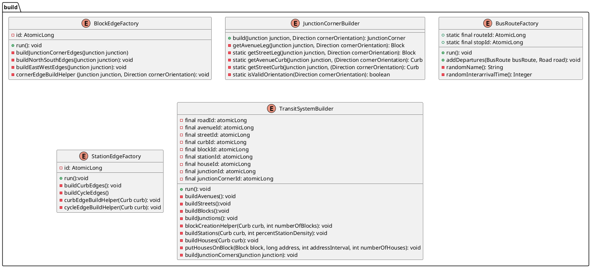

# `com.lawal.transitcraft.common.build`

---
## Purpose
Certain packages must be built before others. The package:
- Initializes entities earlier in the dependency chain.
- Injects lower in the hierarchy into constructors, builders, ir factories.
- Maintains system's build-or-dependency.
- Populates repositories with test data

---
## Package Dependencies
Requires:
- `com.lawal.transitcraft.infrastructure`

---
## Class Relationship
